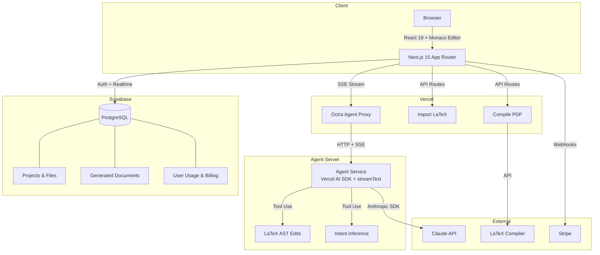

<p align="center">
  
</p>

<h1 align="center">Octree</h1>

<p align="center"><strong>AI-Powered LaTeX Editor</strong></p>

<p align="center">
Write, edit, and compile LaTeX with AI assistance. Chat with Claude to generate documents,<br/>
get intelligent edit suggestions, and collaborate in real time.
</p>

<p align="center">
  <a href="https://useoctree.com">Website</a> &bull;
  <a href="#getting-started">Quick Start</a> &bull;
  <a href="https://github.com/basilysf1709/octree">GitHub</a>
</p>

<p align="center">
  
  
  
  
  
</p>

## Architecture



## What is Octree?

Octree is an AI-powered LaTeX editor that brings intelligent writing assistance to academic and technical document creation. Write LaTeX in a Monaco-based editor, chat with Claude for help, and compile to PDF — all in one place.

**Key features:**

- **AI edit suggestions** — Claude analyzes your LaTeX and proposes inline edits you can accept or reject
- **Document generation** — describe what you need in chat and get a full LaTeX document
- **Live PDF compilation** — compile and preview your document without leaving the editor
- **Project-based workspace** — organize files into projects with a familiar file tree
- **Real-time collaboration** — invite collaborators to work on projects together
- **Zotero integration** — sync your reference library directly into projects

## Getting Started

### Prerequisites

- Node.js 18+
- A [Supabase](https://supabase.com) project
- A [Stripe](https://stripe.com) account (for billing)
- A [Claude API](https://console.anthropic.com) key (for AI features)

### Setup

```bash
git clone https://github.com/basilysf1709/octree.git
cd octree
npm install
```

Copy the example environment file and fill in your keys:

```bash
cp .env.example .env.local
```

Start both the Next.js app and the agent server:

```bash
# Terminal 1 — Next.js app
npm run dev

# Terminal 2 — Agent server
cd agent_server
npm install
npm run dev    # starts on port 8787
```

Both services need to be running for AI features to work.

### Commands

| Command | Description |
|---------|-------------|
| `npm run dev` | Start dev server with Turbopack |
| `npm run build` | Production build |
| `npm run lint` | Run ESLint |
| `npm run test` | Run all tests (Vitest) |
| `npm run test:watch` | Watch mode |

## Tech Stack

| Layer | Technology |
|-------|------------|
| Framework | Next.js 15 (App Router) |
| Language | TypeScript (strict mode) |
| UI | React 19, shadcn/ui, Tailwind CSS |
| Editor | Monaco Editor |
| Database | Supabase (PostgreSQL) |
| Auth | Supabase Auth |
| AI | Vercel AI SDK, @ai-sdk/anthropic |
| Payments | Stripe |
| Hosting | Vercel |

## Security

If you find a security vulnerability, please email **basil@useoctree.online** instead of opening a public issue.

## Self-Hosting

If you want to self-host Octree, please reach out to **basil@useoctree.online**.

## License

LGPL-3.0 — see [LICENSE](LICENSE) for details.
